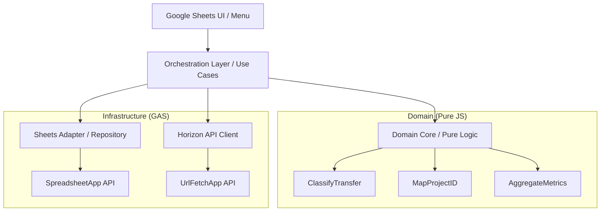

# Архитектурная проработка: Эволюция системы и модуль Resident Tracking

## 1. Executive Summary
Проект `stellar-scrypt` находится в критической точке: текущий production-код [`clasp/Резиденты Мабиз.js`](../clasp/Резиденты%20Мабиз.js) представляет собой высокосвязный монолит (2500+ строк), где UI, бизнес-логика, работа с Google Sheets и внешними API (Horizon, ClickUp) перемешаны. Реализация новой заявки по **Resident Tracking** (6 комплексных сценариев мониторинга) в рамках текущей структуры приведет к экспоненциальному росту хрупкости системы и стоимости поддержки.

**Ключевое решение:** Переход от монолита к слоистой архитектуре (Domain Driven Design Lite) при сохранении совместимости с Google Apps Script (GAS). Модуль Resident Tracking станет первым компонентом, реализованным по новым стандартам "чистой" логики, отделенной от инфраструктуры Sheets/Horizon.

---

## 2. Current-State Risks (Анализ рисков)
1.  **Риск хрупкости данных (Fixed-column):** Ключевые функции (например, дедупликация в `getExistingTransferKeys` и маппинг в `parseResidentsSheet`) жестко завязаны на индексы колонок (J, O, Q, R). Любая вставка колонки пользователем в Sheets ломает систему без явных ошибок.
2.  **Риск "слепого" тестирования:** Текущие Jest-тесты (например, [`__tests__/classifyTransfer.test.js`](../__tests__/classifyTransfer.test.js)) тестируют **копии** функций, а не реальный production-код. Это создает ложное чувство безопасности (False Positive).
3.  **Риск связанности (Coupling):** Невозможно изменить формат хранения данных в Sheets без переписывания логики классификации или интеграции с API.
4.  **Риск производительности:** Монолитный подход затрудняет оптимизацию вызовов Horizon API и использование кэша для Resident Tracking, который требует глубокого анализа графов транзакций.

---

## 3. Target Architecture (Целевая архитектура)

Предлагается разделение системы на 5 логических слоев (через разделение на файлы в GAS):

### 3.1 Слои декомпозиции
| Слой | Назначение | Ограничения |
| :--- | :--- | :--- |
| **Domain (Core)** | Чистая логика (классификация, маппинг, расчеты). | **ЗАПРЕЩЕНО** использовать `SpreadsheetApp`, `UrlFetchApp`. Только JS. |
| **Adapters (Sheets)** | Чтение/запись данных в Google Sheets. | Доступ к данным **только** через имена колонок (Header-based). |
| **Adapters (Horizon)** | Клиент для Stellar API. | Типизация ответов Stellar, обработка Rate Limits. |
| **Orchestration** | Координация сценариев (Use Cases). | Например: "Синхронизировать данные по резиденту и обновить timeline". |
| **UI / Apps Script** | Меню, диалоги, триггеры. | Входная точка системы. |

### 3.2 Схема взаимодействия (Mermaid)

---

## 4. Domain Boundaries & Resident Tracking Scenarios
Для реализации 6 сценариев заявки выделяются следующие доменные области:

1.  **Issuer Monitoring Core**: Логика фильтрации и классификации операций эмитента (payments, trades, swaps).
2.  **Account Structure Graph**: Алгоритмы построения связей (trustlines, ownership) на основе данных балансов.
3.  **Timeline Engine**: Логика определения "точки входа" и хронологии событий.
4.  **Token Flow Analyzer**: Алгоритмы отслеживания цепочек трансферов учетных токенов.

---

## 5. Data Contracts & Sheet Schema Strategy
Для устранения рисков `fixed-column` внедряется **Repository Pattern**:

*   **Header Discovery:** При каждом запуске скрипт ищет индекс колонки по её имени в первой строке.
*   **Validation:** Если обязательная колонка (например, `tx_hash` или `project_id`) не найдена, выполнение прерывается с понятной ошибкой.
*   **Новые листы для Resident Tracking:**
    *   `RT_TIMELINE`: Системный лог событий резидента (Append-only).
    *   `RT_STRUCTURE`: Витрина связей аккаунтов (Snapshot).
    *   `RT_TOKEN_FLOW`: Детальный путь токенов (Snapshot/Graph data).

---

## 6. Test Architecture Strategy (Решение разрыва Jest/GAS)
Чтобы Jest-тесты проверяли реальный код, необходимо изменить способ сборки:

1.  **Модульность:** Выделить Domain Logic в отдельные `.js` файлы (в GAS они будут видны глобально, а в Node.js/Jest их можно импортировать через `require`).
2.  **Dependency Injection:** Передавать данные (из Sheets или Horizon) в функции Domain Core как простые объекты.
3.  **Regression Tests:** Создать набор интеграционных тестов, которые имитируют (через Mock) ответы Horizon API для сложных сценариев Resident Tracking.

---

## 7. Delivery Roadmap (Этапы реализации)

### Этап 1: Refactoring Enabler (Foundation)
*   **1.1:** Создание `SheetsRepository.js` с Header-based поиском.
*   **1.2:** Перенос текущей логики классификации и маппинга из `Резиденты Мабиз.js` в `DomainCore.js` без изменения логики.
*   **1.3:** Настройка Jest для импорта `DomainCore.js`.

### Этап 2: Core Resident Tracking (Scenarios 2.1 - 2.3)
*   **2.1:** Реализация мониторинга эмитента (входящие/исходящие, фильтрация).
*   **2.2:** Сбор данных по Trustlines и построение структуры аккаунтов.
*   **2.3:** Определение "точки входа" и базовый Timeline.

### Этап 3: Advanced Analytics (Scenarios 2.4 - 2.6)
*   **3.1:** Анализ Swap-операций и Стейблкоинов.
*   **3.2:** Отслеживание Trade-операций и обменных пар.
*   **3.3:** Прослеживание путей (Flow) учетных токенов.

### Этап 4: UI & Dashboarding
*   **4.1:** Добавление специализированного меню "Resident Tracking".
*   **4.2:** Создание сводного Dashboard в Sheets.

---

## 8. Risks & Mitigations
| Риск | Смягчение |
| :--- | :--- |
| **Лимиты GAS (Execution Time)** | Использование курсоров для инкрементального обновления и `CacheService`. |
| **Сложность графов в Sheets** | Ограничение глубины вложенности связей в первой итерации (до 2-3 уровней). |
| **Merge Conflicts** | Четкое разделение новых функций в новые файлы, уменьшение правок в `Резиденты Мабиз.js`. |

---

## 9. Questions for Stakeholders (Ключевые вопросы)
1.  **Границы "Структуры фонда":** Какие именно аккаунты (кроме тех, что в `CONST`) считаются частью фонда при анализе "внутренних" vs "внешних" перемещений?
2.  **Глубина истории:** Насколько глубоко в прошлое нужно анализировать транзакции для определения "точки входа"? (Лимиты Horizon API на старые транзакции).
3.  **Приоритет сценариев:** Является ли сценарий 2.6 (Flow токенов) обязательным в первой итерации, учитывая его техническую сложность?

---

## 10. Recommended Documentation Updates
1.  Обновить `ADMIN_SHEETS_AND_DATA_CONTRACT.md`, добавив описание новых листов `RT_*`.
2.  Создать `DEVELOPER_GUIDE.md` с описанием слоистой архитектуры и правил именования.
3.  Обновить `USER_MENU.md` после внедрения новых пунктов меню.
